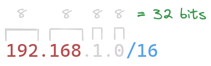
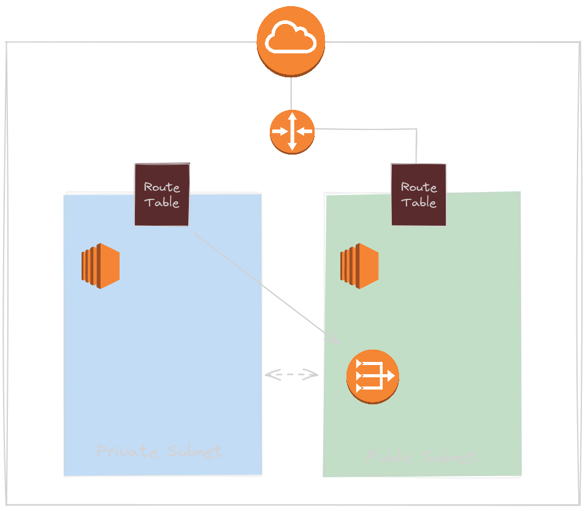

# Subnets
O que são? Como funcionam?

---

# O que são?

São como *blocos* que segmentam uma rede em unidades mais gerenciáveis, facilitando o gerenciamento e a segurança

---

# IPv4 CIDR Ranges

A quantidade de subnets possíveis se baseia na gama de IPs determinada na criação de nossa VPC

---

* Neste exemplo, temos possíveis IPs no range
    * ***192.168.0.1 até 192.168.255.255***
 
* Com uma *subnet mask*
    * 255.255.0.0

---

# Quantas subnets temos?

Isso nos dá cerca de 65,536 - 5 hosts possíveis

---

## Por que "-5"?

Pois temos IPs reservados, como:
 

* ***192.168.0.0***: É o próprio endereço da rede

* ***192.168.0.1***: *Reservado pela AWS para* routing VPC

* ***192.168.0.2***: *Reservado pela AWS como* server DNS

* ***192.168.0.3***: *Reservado pela AWS para* uso futuro

* ***192.168.0.255***: É o endereço de *Broadcast*

---

# *my-test-VPC*

- PublicSubnet
    - public-route-table
        - Internet Gateway
 

- PrivateSubnet
    - private-route-table
        - NAT Gateway

---

# O que é NAT?

Network Address Translation

---

## Qual sua função

NAT é uma ferramenta que tem a função de permitir que instâncias em uma subnet privada se conectem com serviços exteriores a nossa VPC mas não permite que serviços exteriores acessem nossa instância

---

# O que é Internet Gateway?

É um dispositivo que conecta a rede local a internet

---

## Qual sua função

Tem a função de atuar como um ponto de entrada e saída para o tráfego da rede local, conectando a rede interna com a infraestrutura da internet